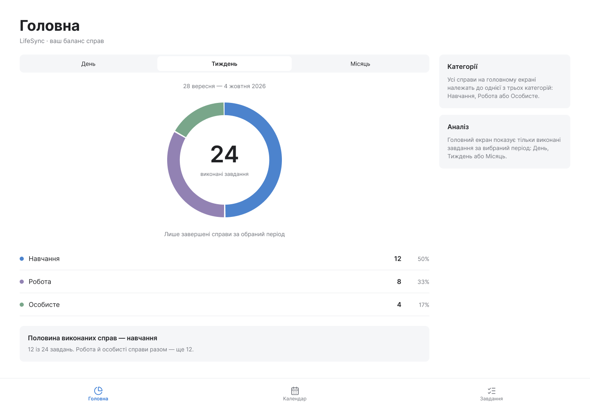
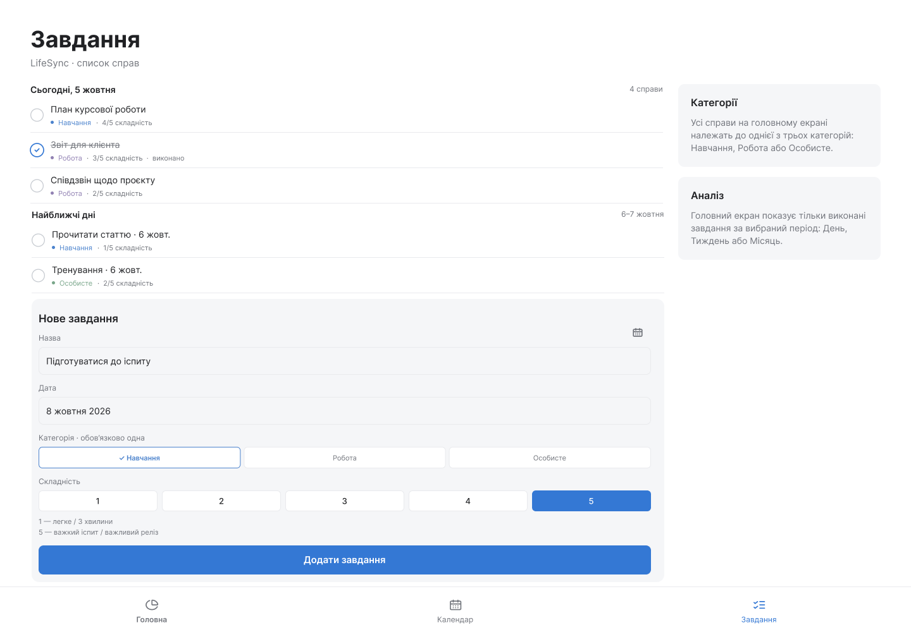
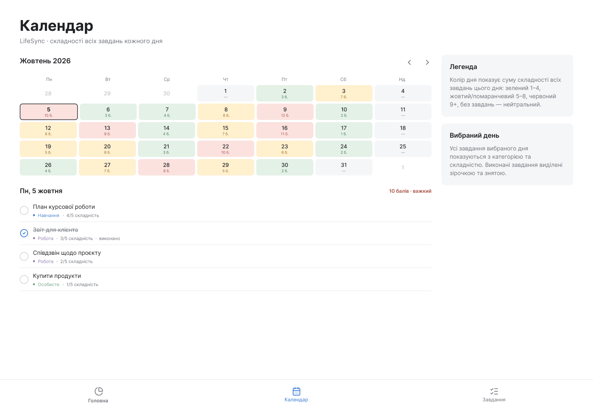

# Лабораторна робота №2
**Тема:** Проєктування та розробка інтерфейсу користувача для застосунку "LifeSync"  
**Виконав:** студент групи КН Граб Сергій  
**Репозиторій проєкту:** [LifeSync](https://github.com/Serhiy69/LifeSync)

---

##  1. Опис проєкту та його призначення

**LifeSync** — це універсальний таск-менеждер для розмежування навчання, роботи, та особистого життя, призначений для організації щоденних завдань, планування подій у календарі та трекінгу виконаних справ.

### Основні цілі веб-застосунку:
* Зменшення хаосу в щоденному плануванні.
* Об'єднання завдань та календарних подій у єдиному зручному інтерфейсі.
* Надання швидкого доступу до авторизації та персонального кабінету.

---

## 2. Огляд дизайну та структури інтерфейсу

У ході лабораторної роботи було розроблено та оновлено дизайн ключових екранів застосунку:

### 2.1. Екран авторизації (Authorization)
Призначений для входу користувача в систему та реєстрації нових акаунтів.
.png)

---

### 2.2. Головний екран (Main)
Центральна панель, яка відображає кругову діаграму виконаних справ та їх відношення.

---

### 2.3. Менеджер завдань (Tasks)
Модуль для створення, редагування та відмітки виконаних списків справ.

---

### 2.4. Календар та розклад (Calendar)
Інтерактивний календар для візуального планування подій на тиждень/місяць.

---

##  4. Висновки до роботи

Під час виконання лабораторної роботи №2 було:
1. Оновлено та оптимізовано дизайн користувацького інтерфейсу застосунку LifeSync.
2. Актуалізовано та структуровано інформацію щодо сторінок веб-застосунку.
3. Оформлено звіт у форматі `README.md`.
